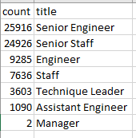
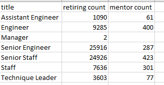
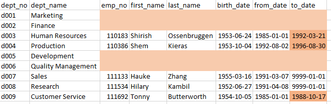

# Pewlett Hackard Analysis - Module 7 Challenge

## Overview of the Analysis

The purpose of this analysis is to create a table of the retiring emplyees at Pewlett Hackard by their title. As well, another important part of the analysis is to find how many employees are also eligible to participate in a mentorship program to mentor upcoming employees to fill in gaps as people retire.

## Resources Used
- Data Source: departments.csv, dept_emp.csv, dept_manager.csv, employees.csv, salaries.csv, titles.csv
- Software: PostgreSQL 11.15, pgAdmin 4 6.1


## Results

Processing the data created many tables, and the endpoint of those tables will be shown as they become relevant. The SQL queries are saved in the Queries Folder as Employee_Database_challenge.sql

The first task was the creation of  a table that housed all employees who are retiring, as well as their current position. This was completed by creating 'retirement_titles.csv' which filtered the retiring employees by these conditions:

To indicate the date range of retiring employees:
```
WHERE (e.birth_date BETWEEN '1952-01-01' AND '1955-12-31')
```

To determine that the position of the employee is current into 'unique_titles.csv' :
```
WHERE to_date = '9999-01-01'
```

This was then filtered by count to produce this table stored in 'retiring_titles.csv'


The second task was to determine emplyees eligible for mentorship 'mentorship_eligibilty.csv', determined as people born in the year 1965.

Some findings found by this analysis are below:
- Based on the table produced, approximately 72000 employees will be retiring and need replacement.
- Significantly, two managers will also be retiring, which would need more consideration for replacement and training.
- There are approximately 1500 people eligible for mentorship, which is a roughly 45:1 ratio of people who will need mentoring if every retired position is filled compared to the amount of available mentors.
- If you search through the mentorship_eligibility data, there are no Managers available for mentoring.


## Summary

To address the upcoming "Silver Tsunami", while the table produced in retiring_titles.csv indicates the total amount of people retiring, this may not necessarily indicate the amount of people being replaced. One issue with the analysis is it may not take into account any developments in technology to change the workflow at Pewlett Hackard which may impact how many employees need to be replaced.

Another issue impacting that "Silver Tsunami" is the breakdown by departments, which would both impact the retiring employees and the mentorship requirements, as each department may have special needs.

An analysis into retirement ready mentors indicates a bigger issue in the data for this Pewlett-Hackard analysis. To determine the relationship between Mentors available and retiring employees, a table was produced with the query below:

```
SELECT COUNT(title), title
INTO mentorship_title_count
FROM mentorship_eligibilty
GROUP BY title
ORDER BY COUNT(title) DESC;
```
And it was combined with the previous retirement count table with a left join to produce the 'mentorship_needs.csv' table shown below.

```
SELECT rt.title, rt.count as "retiring count", mtc.count as "mentor count"
INTO mentorship_needs
FROM retiring_titles as rt
	LEFT JOIN mentorship_title_count as mtc
		ON rt.title = mtc.title
ORDER BY title
```


While there would need to be a management decision on ideal ratios to mentors to new employees that could be adjusted by redefining the current mentorship criterion of being born in 1965, the fact that there were no managers eligible for mentorship revealed a more important issue. While this would initially indicate a potential that recruiting may need to focus more on previous management experience, it hinted at missing data under further analysis.

The following SQL query and results illustrate each department at Pewlett-Hackard with the managers listed, which indicates a lot of missing data, placed into 'manager_issues.csv', with concerning data highlighted for emphasis.

```
-- Task 3 additional table 2 - issues with managers in database
SELECT  d.dept_no,
		d.dept_name,
		e.emp_no,
		e.first_name,
		e.last_name,
		e.birth_date,
		m.from_date,
		m.to_date
INTO manager_issues
FROM departments AS d
    LEFT JOIN manager_info AS m
        ON (d.dept_no = m.dept_no)
	LEFT JOIN employees as e
		ON (m.emp_no = e.emp_no)
ORDER BY d.dept_no;
```



Multiple departments are listed with no manager, some departments have no current manager, and the two departments that have a current manager mean that the two identified retiring managers are in fact the only two managers listed here who are current. Pewlett-Hackard will need to be contacted to supply missing data on their managers and other parts of the anlysis to ensure all data has been properly given over to complete the analysis, or determine whether management data should be handled separately.